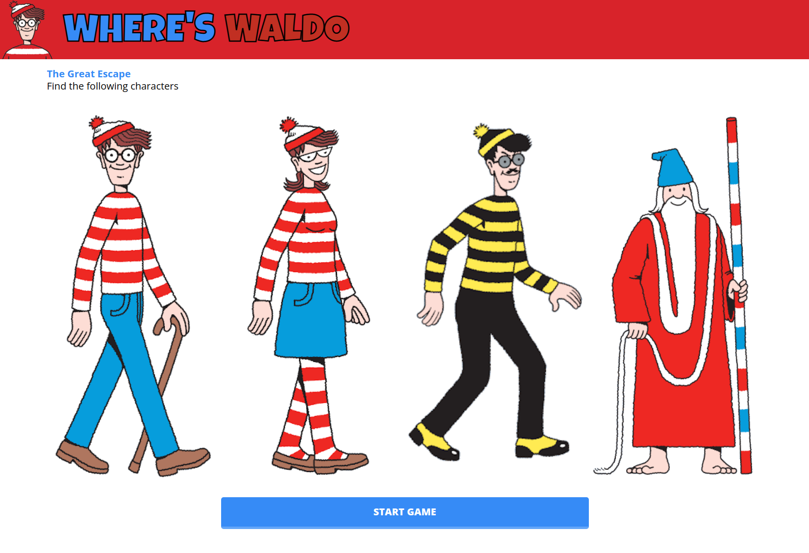
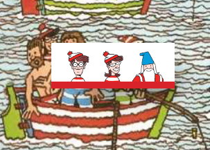
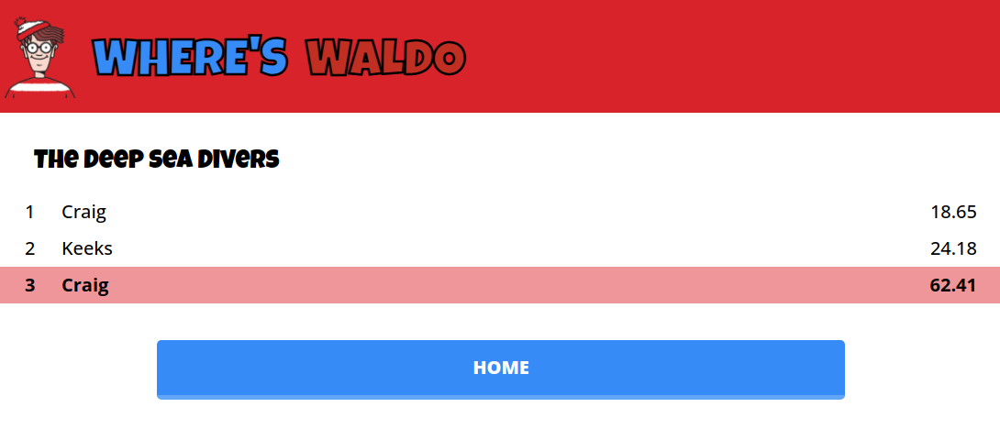
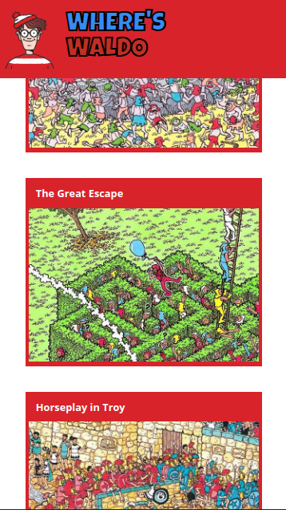
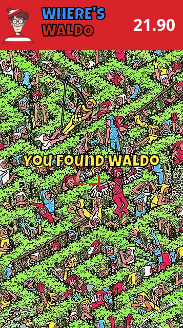
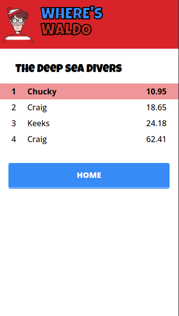

<!--
*** Thanks for checking out the Best-README-Template. If you have a suggestion
*** that would make this better, please fork the repo and create a pull request
*** or simply open an issue with the tag "enhancement".
*** Don't forget to give the project a star!
*** Thanks again! Now go create something AMAZING! :D
-->

<!-- PROJECT SHIELDS -->
<!--
*** I'm using markdown "reference style" links for readability.
*** Reference links are enclosed in brackets [ ] instead of parentheses ( ).
*** See the bottom of this document for the declaration of the reference variables
*** for contributors-url, forks-url, etc. This is an optional, concise syntax you may use.
*** https://www.markdownguide.org/basic-syntax/#reference-style-links
-->

<!-- [![Contributors][contributors-shield]][contributors-url]
[![Forks][forks-shield]][forks-url]
[![Stargazers][stars-shield]][stars-url]
[![Issues][issues-shield]][issues-url]
[![MIT License][license-shield]][license-url] -->

[![LinkedIn][linkedin-shield]][linkedin-url]

<!-- PROJECT LOGO -->
 

  

<h3 align="center">Where's Waldo</h3>

  

    A Where's Waldo app created in React with Typescript and Firebase.
     
    <a href="https://github.com/craigmclean39/waldo-top"><strong>Explore the docs »</strong></a>
     
     
    <a href="https://github.com/craigmclean39/waldo-top">View Demo</a>
    ·
    <a href="https://github.com/craigmclean39/waldo-top/issues">Report Bug</a>
    ·
    <a href="https://github.com/craigmclean39/waldo-top/issues">Request Feature</a>
  

<!-- TABLE OF CONTENTS -->

  
<h2 style="display: inline-block">Table of Contents</h2>

  <ol>
    <li>
      <a href="#about-the-project">About The Project</a>
      <ul>
        <li><a href="#built-with">Built With</a></li>
        <li><a href="#libraries-used">Libraries Used</a></li>
      </ul>
    </li>
    <li>
      <a href="#getting-started">Getting Started</a>
    </li>
    <li><a href="#features">Features</a></li>
    <li><a href="#contact">Contact</a></li>
    <li><a href="#acknowledgements">Acknowledgements</a></li>
  </ol>

<!-- ABOUT THE PROJECT -->

## About The Project

[![Product Name Screen Shot][product-screenshot]](https://craigmclean39.github.io/waldo-top/)

This project was part of The Odin Project Full Stack JavaScript curriculum. The intention of the project was to gain experience using a BaaS (Backend as a service). For this project I utilized the Firebase platform. The project was also created using React with React Router, and Typescript. On the server side I am storing the characters hidden locations for each stage. When the user makes a selection, their selected position is then compared to the server side position to determine whether they have successfully located the character. When the user begins a stage I am creating a session entry on the server, on creation it simply has a sessionId and the server timestamp for when the level was started. When the level is completed I then write another timestamp to the session to indicate the time they completed the level at. These two timestamps are then used to determine the total time the user spent on the stage. After completion the user is queried for their name, and the name along with their time, are stored in a leaderboard for the given stage.

(<a href="#top">back to top</a>)

### Built With

- [JavaScript](https://developer.mozilla.org/en-US/docs/Web/JavaScript)
- [CSS](https://developer.mozilla.org/en-US/docs/Web/CSS)
- [React.js](https://reactjs.org/)
- [Typescript](https://www.typescriptlang.org/)
- [Firebase](https://firebase.google.com/)

### Libraries Used

- [React Router](https://reactrouter.com/)

(<a href="#top">back to top</a>)

<!-- GETTING STARTED -->

## Getting Started

Take a look at the demo <a href="https://craigmclean39.github.io/waldo-top/">here.</a>

## Features

- Select one of 4 stages to play. 
  

- See a list of characters to find. 
  
- Find the hidden characters. 
  
  
- Attempt to get a highscore! 
  

- Full mobile support 

<!-- CONTACT -->

## Contact

Craig McLean - craig@craigmclean.dev 
https://www.linkedin.com/in/mcleancraig/

Project Link: [https://github.com/craigmclean39/waldo-top](https://github.com/craigmclean39/waldo-top)

(<a href="#top">back to top</a>)

<!-- ACKNOWLEDGMENTS -->

## Acknowledgments

- [The Odin Project](https://www.theodinproject.com/)
- [Google Fonts](https://fonts.google.com/)
- [Where's Waldo](https://waldo.candlewick.com/)

(<a href="#top">back to top</a>)

<!-- MARKDOWN LINKS & IMAGES -->
<!-- https://www.markdownguide.org/basic-syntax/#reference-style-links -->

[linkedin-shield]: https://img.shields.io/badge/-LinkedIn-black.svg?style=for-the-badge&logo=linkedin&colorB=555
[linkedin-url]: https://www.linkedin.com/in/mcleancraig/
[product-screenshot]: ./readme-images/readme-gameplay.png
